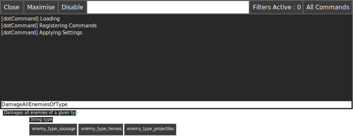

.. _learn_advanced_suggestions:

Introduction
============

When providing :ref:`learn_step_by_step_custom_command` to .Command, you can also present suggestions to the user on
what they can input.

This could be useful when a function can be called with any data, but you want to provide hints to content creators
who might not know all the possibilities, it provides a more user friendly interface to .Command.

Improving an existing method
----------------------------

Suppose our 'real world' example has the following class with the following method.

.. code-block:: c#

    public static class Cheats
    {
        [ConsoleCommand(Description = "Damages all enemies of the given type")]
        public static void DamageAllEnemiesOfType(string type)
        {
            if (type == "enemy_type_sausage")
            {
                // Damage all sausages
            }
            if (type == "enemy_type_heroes")
            {
                // Damage all heroes
            }
            if (type == "enemy_type_projectiles")
            {
                // Damage all projectiles
            }
        }
    }

The method DamageAllEnemiesOfType takes a type string, but inside the body, we're expecting certain values. You can
provide hints to .Command, so that it can present a friendly user interface.

Using the example above, we know that the data received should be one of the following values "enemy_type_sausage",
"enemy_type_heroes" or "enemy_type_projectiles". So, let's present that to the user of .Command.

We firstly need to create a class which implements ISuggestion. Inside this class we want to return a list of suggested
data, for example

.. code-block:: c#

    public class EnemyTypeSuggestion : ISuggestion
    {
        public IEnumerable<string> Suggestion(IEnumerable<string> previousArguments)
        {
            return new[] { "enemy_type_sausage", "enemy_type_heroes", "enemy_type_projectiles" };
        }
    }

The final step is to tell the ConsoleCommand to use our suggestion, you can do this by adding a parameter Attribute, as
shown in the highlighted line.

.. code-block:: c#
   :emphasize-lines: 4

    public static class Cheats
    {
        [ConsoleCommand(Description = "Damages all enemies of the given type")]
        public static void DamageAllEnemiesOfType([Suggestion(typeof(EnemyTypeSuggestion))]string type)
        {
            if (type == "enemy_type_sausage")
            {
                // Damage all sausages
            }
            if (type == "enemy_type_heroes")
            {
                // Damage all heroes
            }
            if (type == "enemy_type_projectiles")
            {
                // Damage all projectiles
            }
        }
    }

If you press play in Unity and open .Command you should see that it now starts to show you suggestions for your
parameter.

.. note:: It's possible to add more than one suggestion to a method, in fact you can add one per parameter.
