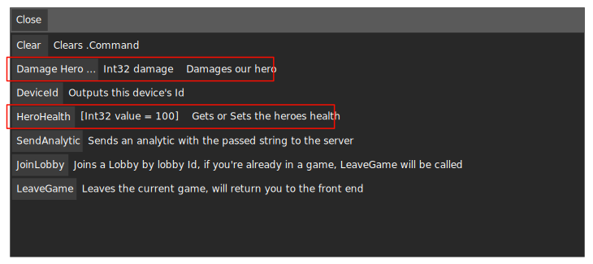

.. _learn_step_by_step_custom_command:

Custom Commands
===============

Introduction
------------

.Command comes with a selection of :ref:`learn_step_by_step_built_in_commands`, though it's completely possible to
expose any method in your codebase to .Command. In most cases it requires setting an attribute.

* Methods
    Methods can be fully exposed both static and non static

* Properties
    Both the get and set Property can be exposed to .Command

Custom Command Examples
-----------------------

The following 'real world' use cases should help you with exposing your existing codebase as Commands with .Command.

Each time you want to expose a method to .Command you will go through the following steps.

1. Register your object with .Command so .Command knows where to look for your commands.

2. Mark up your code with a custom attribute.

3. You are now fully exposed to .Command

Creating a static cheats class
^^^^^^^^^^^^^^^^^^^^^^^^^^^^^^

One common use cases when developing games is to create a central class which acts as a cheat container. We're going to
assume the following class already exists.

.. code-block:: c#

    public static class HeroCheats
    {
        private static int _heroHealth = 100;

        public static int HeroHealth
        {
            get { return _heroHealth; }
            set { _heroHealth = value; }
        }

        public static void DamageHero(int damage)
        {
            HeroHealth -= damage;
        }
    }

We want to follow the steps introduced in the `Custom Command Examples` section :

1. Register the object with .Command. (You can do this anywhere in your code base).

.. code-block:: c#

    DevelopmentCommands.Register(typeof(HeroCheats));

    .. note:: After registering a type or object, when you want to remove those commands from .Command you can also call
                DevelopmentCommands.Unregister to unregister that object

2. Mark up your code. (See the highlighted lines for additions)

.. code-block:: c#
   :emphasize-lines: 5,12

    public static class HeroCheats
    {
        private static int _heroHealth = 100;

        [ConsoleCommand(Description = "Gets or Sets the heroes health")]
        public static int HeroHealth
        {
            get { return _heroHealth; }
            set { _heroHealth = value; }
        }

        [ConsoleCommand(Description = "Damages our hero")]
        public static void DamageHero(int damage)
        {
            HeroHealth -= damage;
        }
    }

3. These methods and properties are now exposed to .Command. If you press play in Unity and open the
:ref:`learn_step_by_step_ui_overview_all_commands_window`, you should see the following additions:

* HeroHealth
    The Property exposed to .Command has been automatically added to the
    :ref:`learn_step_by_step_ui_overview_all_commands_window`, here we can see that the description has also been
    extracted as well as a little description of the type of data that this command can consume, along with it's
    current value.

* DamageHero
    The Method exposed to .Command has been automatically added to the
    :ref:`learn_step_by_step_ui_overview_all_commands_window`, here we can see that the description has also been
    extracted as well as a little description of the type of data that this command can be passed to this method.

Have a play around with these exposed methods to get a feel for how they work, and what they do, then feel free to go
and add the ConsoleCommand attribute to your own codebase!

.. note:: Ensure you only call DevelopmentCommands.Register() with a type once or you may end up with duplicate commands
            in your :ref:`learn_step_by_step_ui_overview_all_commands_window`

ConsoleCommands on instance classes
^^^^^^^^^^^^^^^^^^^^^^^^^^^^^^^^^^^

It's worth noting that you can add the ConsoleCommand attribute to any property or method on any class, static or not.
If you're going to add an instance class, you must change slightly the first step, instead of

.. code-block:: c#

    DevelopmentCommands.Register(typeof(HeroCheats));

you would add the following

.. code-block:: c#

    // This would be instantiated somewhere else
    var someInstantiatedObject = new SomeInstantiatedObject();

    // Add your instantiated object instead of the type
    DevelopmentCommands.Register(someInstantiatedObject);

.. note:: In this case, instantiated object could be anything, from a plain old class, to a MonoBehaviour or
            EditorScript, it really doesn't matter, as long as you register the object or type (for static classes),
            your ConsoleCommand Attributes will be automatically added to .Command

.. warning:: After registering an instantiated object, be sure to unregister it with DevelopmentCommands.Unregister
            when the object is destroyed. If you don't do this, nothing bad will happen, however it's good practise
            to match your register calls with an unregister call.

Next Up
-------

Skinning .Command and tweaking global settings.

