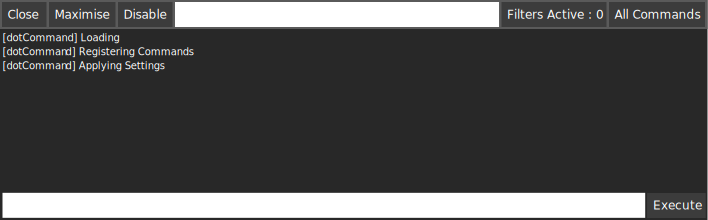

.. _learn_step_by_step_quick_start:

Quick Start
===========

.Command is built to be incredibly easy to use, in here, you're going to find two sections, one will get you running
with no work, and the other is a bit more manual, but provides you more control.

Its recommended that you follow the `Slightly less Quick Start`_ for more control over .Command, but for those of you
who are unfamiliar with writing code (or simply don't want to), you can get started with the `Quickest Start`_ section.

.. _learn_step_by_step_quick_start_quickest_start:

Quickest Start
--------------
Simply drag the prefab DebugConsoleLoader from the /WellFired/WellFired.Command.Prefabs directory into your scene and
press play. You can now toggle .Command with the tilde (~) key, or by pressing the button at the top left of the screen.
Once open .Command should look something like this.

.. _learn_step_by_step_quick_start_slightly_less_quick_start:

Slightly less Quick Start
-------------------------

The recommended approach when loading .Command is as follows.

For this quick start, we assume you already have an entry point, or a single place in time where you'd like to load and
instantiate .Command.

1) Decide where you'd like to create and maintain your profile session
2) Add the required using

    .. code-block:: c#

        using WellFired.Command.Unity.Runtime.CommandHandlers;
        using WellFired.Command.Unity.Runtime.Console;

3) Load .Command

    .. code-block:: c#

        // Loads .Command with the default settings.
        DevelopmentConsole.Load();

4) Tell .Command to register built in commands.

    .. code-block:: c#

        // Register built in .Command Inspect commands
        DevelopmentCommands.Register(typeof(Inspect));

5) Optionally Customise .Command behaviour. (.Command has sensible defaults).

    .. code-block:: c#

        // Dont auto open when an exception is thrown.
        DevelopmentConsole.Instance.DisableAutoOpen();

        // Show the 'Open Console' for quick access if users don't have a tilde key (for instance mobile platforms)
        DevelopmentConsole.Instance.DrawShowConsoleButton = true;

Now press play in Unity and you can toggle .Command with the tilde (~) key.

And Then?
---------

In the coming pages, you'll learn more about .Commands User Interface, how to filter the log as well as how to add
custom commands.