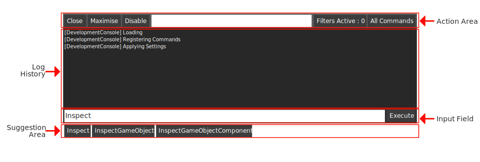
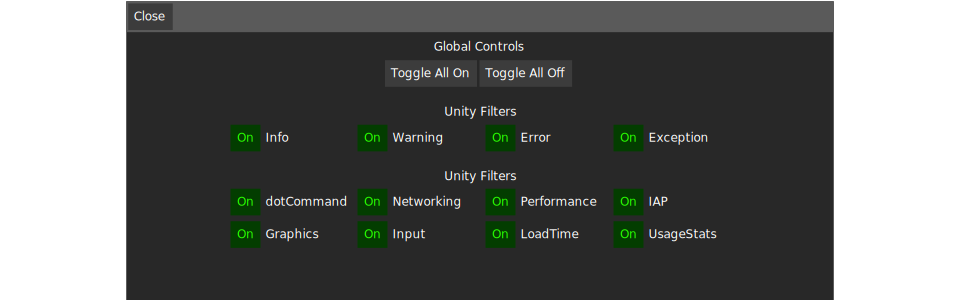
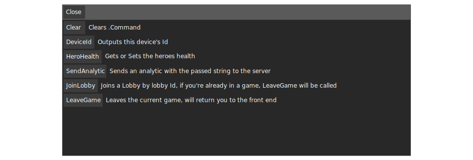
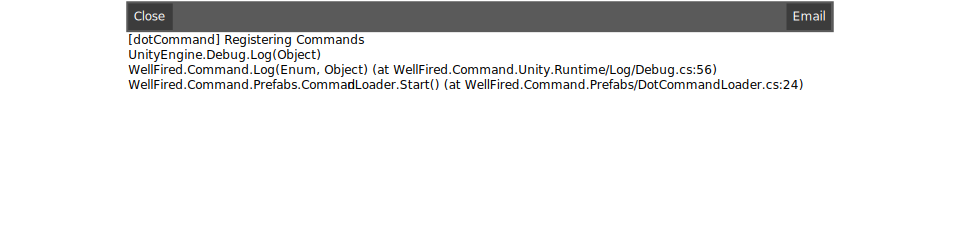

.. _learn_step_by_step_ui_overview:

UI Overview
===========

Introduction
------------
The UI for .Command is not made of many components, so it shouldn't take long to familiarise yourself. If you're
already familiar with the UI or don't want to read this section, it's fine to skip and move on to
:ref:`learn_step_by_step_logs_and_filters`.

Main Window
-----------

.Command is split into a couple of main areas, these are highlighted in the image below. Each of which is covered under
the sub headings below.

Action Area
^^^^^^^^^^^

Here you can find a selection of commonly used actions.

* Close
    will close .Command.

* Maximise
    will ensure .Command uses all available space.

* Disable
    will ensure .Command does not auto open (if this setting is toggled on when .Command loads)

* Filters Active
    This will bring up the `Filter Window`_, allowing you to filter content displayed in the `Log History`_ area.

* All Commands
    This will bring up a quick action window, allowing users to interact with .Command without typing.

.. _learn_step_by_step_ui_overview_log_history:

Log History
^^^^^^^^^^^

Over time the Log History will fill up with your applications logs. these items will be color coded to show you which type
of message you are receiving, this works similar to Unity's Console Window.

Each item in this list can be clicked (or touched) to bring up a separate window showing a full callstack.

Input Field
^^^^^^^^^^^

You can type commands by hand into the input field. .Command also provides you with some autocomplete functionalities,
whilst you have focus on the input field you can press the tab or shift tab keys to cycle forward and backwards through
the suggestions shown in the `Input Field`_.

Suggestion Area
^^^^^^^^^^^^^^^

As you type in the `Input Field`_, suggestions will appear here. These suggestions are buttons and you can click
(or touch) them. .Command will provide you with suggestions for the following things.

* Recently used commands when the `Input Field`_ is empty

* Commands whilst using the `Input Field`_

* Command Parameters after having input a command. Most built in c# types will be automatically parsed and presented to the user in the suggestion box (including enums).

.. _learn_step_by_step_ui_overview_filter_window:

Filter Window
-------------

The filter window allows you to quickly toggle which filters the `Log History`_ will display.

Filters can be toggled on and off, you can also see :ref:`learn_step_by_step_logs_and_filters` for an overview on how
you can add your own custom filters to .Command.

Filters can be toggled on individually and also simultaneously, in the example above, if you toggled on Info and
Warning, your `Log History`_ would only show messages with the Info or Warning Filter.

.. _learn_step_by_step_ui_overview_all_commands_window:

All Commands Window
-------------------

The all commands window allows you to quickly see and execute all commands exposed to .Command

From this window, you can simply click any command you'd like to execute and .Command will do the rest for you.

Log Entry Window
----------------

The log entry window allows you to quickly see a full callstack for any given item in the `Log History`_. Simply click
or tap the item in the `Log History`_ to open this window.

From this window, you can copy the full callstack, or press the email button to open your email client and send the
callstack to any given email address.

To be continued.....
--------------------

In the next section you'll find out how to add your own custom filters to .Command and how you can filter use those
in your game.